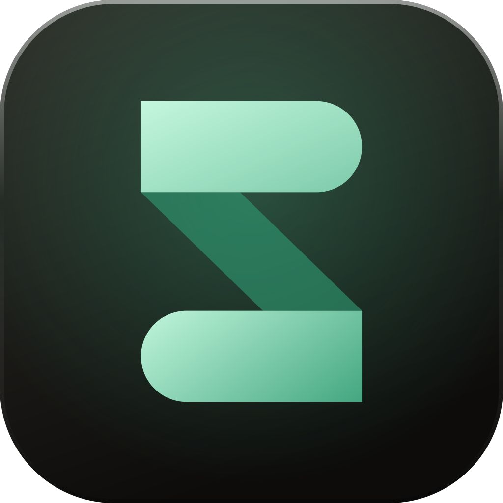
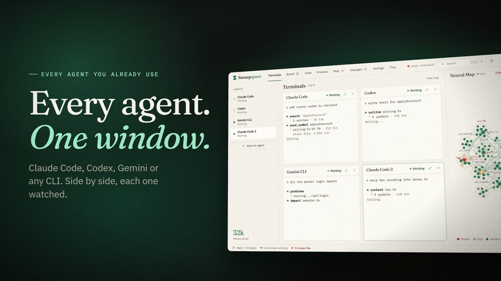
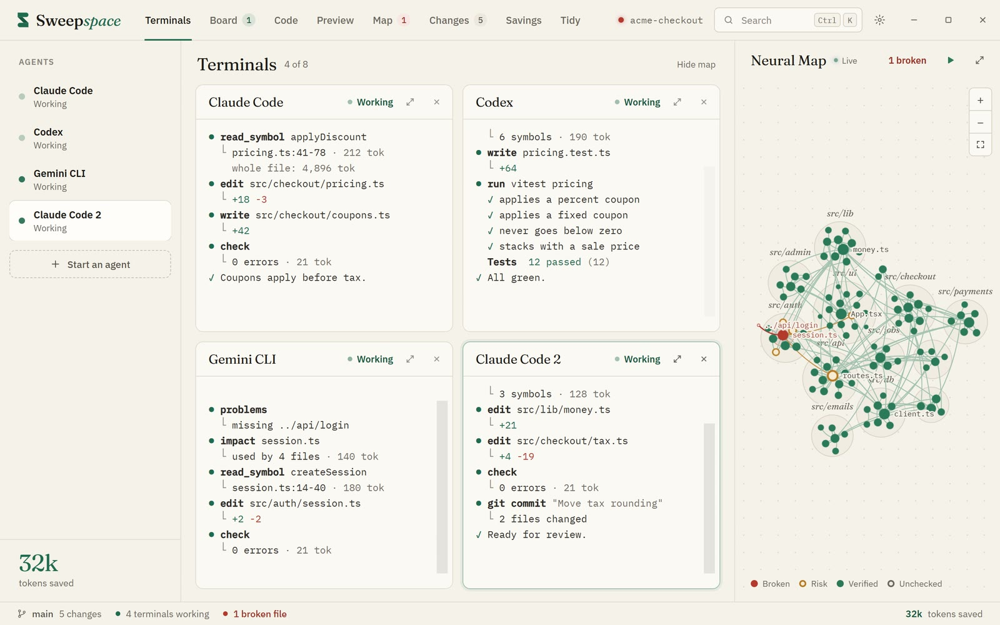
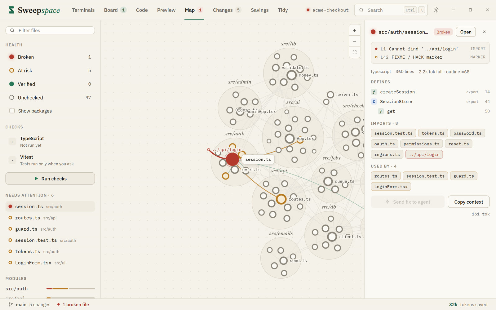
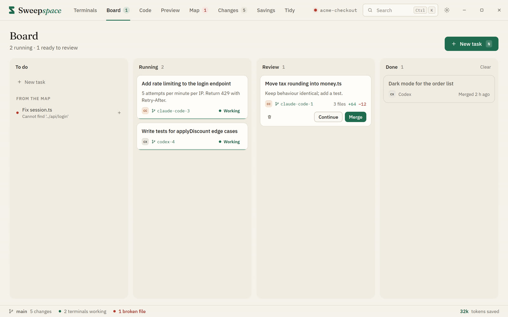
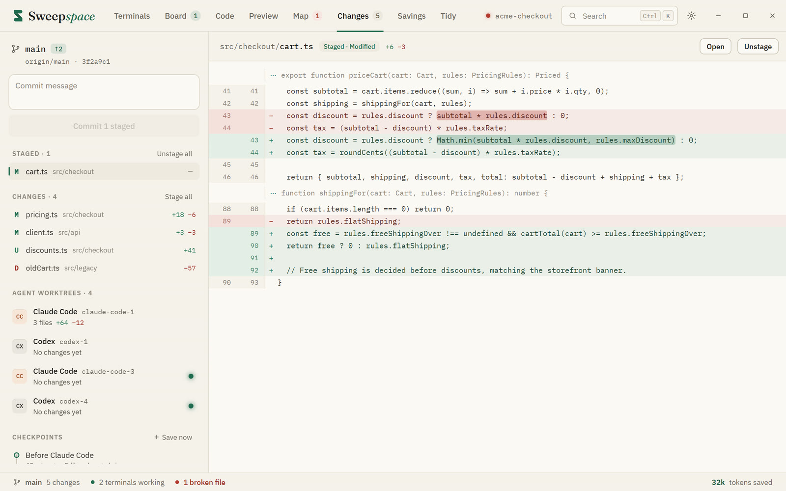
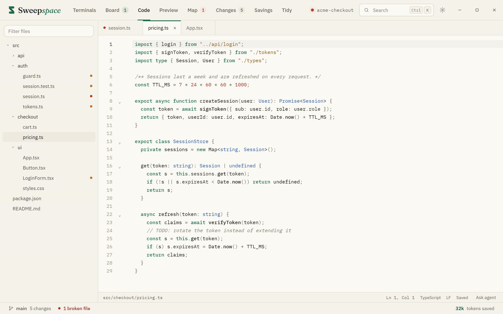
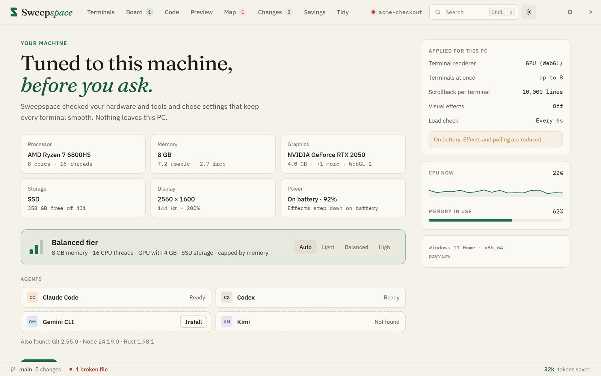

<div align="center">

<a href="https://sweepspace.pages.dev"></a>

# Sweepspace

**Build big. Spend less.**

A desktop workspace for AI coding agents. Run Claude Code, Codex, Gemini and any CLI side by side,<br>
and give every agent a live map of your project so it reads the one function it needs instead of whole files.

[](https://github.com/hedinouairi124-bot/sweepspace/releases/latest)
[](https://sweepspace.pages.dev)

[](https://github.com/hedinouairi124-bot/sweepspace/releases)
[](https://github.com/hedinouairi124-bot/sweepspace/releases)


<a href="https://sweepspace.pages.dev/#film"></a>

<sub><a href="https://sweepspace.pages.dev/#film">▶ Watch the film</a> · <a href="https://sweepspace.pages.dev">sweepspace.pages.dev</a></sub>

</div>

---

## Why

Coding agents burn most of their tokens re-reading files they have already seen. Sweepspace runs a small local MCP server that your agents connect to in one click. Instead of opening whole files, they ask for exactly what they need.

| Measured on a real task (12 steps, Sweepspace's own codebase) | Tokens |
| --- | ---: |
| Opening each file once, in full, plus the compiler's full output | 35,777 |
| **With Sweepspace** | **3,833** |
| | **9.3× fewer** |

Reviewing changes took 14.6× fewer tokens, and type-checking 158× fewer.

The tools agents get: `overview` · `search` · `outline` · `read_symbol` · `read_lines` · `impact` · `context` · `problems` · `check` · `changes`

## Features

<table>
<tr>
<td width="50%" valign="top">

### Every agent. One window.
Claude Code, Codex, Gemini CLI, OpenCode, Aider, Kimi and any shell, in a grid of real terminals. Each agent can work on its own branch.

</td>
<td width="50%"></td>
</tr>
<tr>
<td></td>
<td valign="top">

### A live map of your project
Every file, import and symbol, coloured by health: broken, at risk, verified. Agents read the map instead of the whole repo.

</td>
</tr>
<tr>
<td valign="top">

### Hand out tasks. Review the results.
A board for agent work: queue tasks, run them on separate branches, review and merge.

</td>
<td></td>
</tr>
<tr>
<td></td>
<td valign="top">

### See every change before it lands
Diffs per agent and per branch, with checkpoints you can roll back to.

</td>
</tr>
<tr>
<td valign="top">

### A real editor and a live preview
Edit code next to your agents and watch your dev server update in place.

</td>
<td></td>
</tr>
<tr>
<td></td>
<td valign="top">

### Tuned to your PC
Sweepspace checks your machine and sets how many agents, checks and previews it can run smoothly.

</td>
</tr>
</table>

## Install

1. Download `Sweepspace_x.y.z_x64-setup.exe` from the [latest release](https://github.com/hedinouairi124-bot/sweepspace/releases/latest), or from [the website](https://sweepspace.pages.dev/#download).
2. Check the file (optional, recommended). In PowerShell, in your Downloads folder:
   ```powershell
   Get-FileHash .\Sweepspace_0.1.0_x64-setup.exe
   ```
   The hash must match `SHA256SUMS.txt` in the release.
3. Run it. It installs for your Windows user and doesn't need admin rights.

> [!NOTE]
> The beta installer isn't code-signed yet, so Windows may not recognise it. Edge may say the file isn't commonly downloaded (choose **Keep**), and SmartScreen may say it protected your PC (choose **More info**, then **Run anyway**). Only do that if the hash matches.

**Requirements:** Windows 10 or 11, 64-bit. The agents you want to use (for example Claude Code or Codex) are installed separately and keep their own sign-in.

## Privacy

- Sweepspace runs on your PC. The map, the checks and the machine scan stay local.
- It never stores API keys. Your agents talk to their own providers, as they already do.
- Before it runs a folder's own type checker or tests, Sweepspace asks whether you trust that folder.

## Sweepspace Pro

A paid tier in the works: bots, new ways to delegate, and team features. [See the preview](https://sweepspace.pages.dev/#pro).

## Feedback and support

- Found a bug? [Open an issue](https://github.com/hedinouairi124-bot/sweepspace/issues/new/choose).
- Found a security problem? Please report it privately. See [SECURITY.md](SECURITY.md).

---

<div align="center"><sub>© 2026 Sweepspace. All rights reserved. This repository hosts releases and documentation; the source code is not public.</sub></div>
